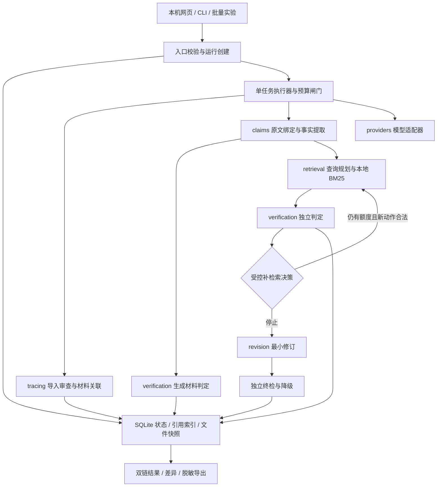

# 生成过程追溯与回答证据验证 Agent：初步设计

版本：v0.2（经 3 个子 agent 独立评审与交叉复核修订）；日期：2026-10-06。  
依据：[需求分析](需求分析.md)、[验收用例](验收用例.md)、[项目 README](../../README.md)。  
状态：本次确定初步工程选型与实现边界，尚未实现、安装依赖或运行真实服务；质量、性能、费用均未测量。意见与处理见[三方交叉评审记录](初步设计_交叉评审.md)。

## 1. 设计结论与决策边界

采用 **Python 3.12 + FastAPI + Pydantic 2 + SQLite + 本地文件快照 + 原生 HTML/CSS/JavaScript**，以显式状态机编排双链核验。首版在本机以单服务进程、单任务执行器运行；网页、命令行和批量实验复用同一核心，不把流程写在界面里。

事后独立检索首版选定 **用户指定的 UTF-8 TXT/Markdown 参考资料，jieba 分词 + BM25 排序**。先交付真实资料检索，不同步构建网络爬虫、向量数据库及混合检索。此选择是本次初步设计决策，后续若任务要求覆盖资料库外的事实，应替换检索适配并重新定义验收范围，不把本地未命中视为现实中不存在。课程快照不自动成为通用事实语料。冻结证据夹具用于测试，并不算另一种真实检索模式。

模型选定 **通过 HTTPX 调用配置化的 OpenAI-compatible Chat Completions 接口**，角色包括提取、判定、查询规划和修订，首版复用一个模型配置。兼容协议不等于使用某家服务，也不保证每个平台完整支持结构化输出；适配层通过能力探针验证实际可用功能。供应商、具体 model_id、版本、计价和授权预算尚无输入，不在设计文档中编造；M0 必须选定并实测一个真实服务，未完成前不能声称真实端到端通过。

生成记录采用一种项目自定义 JSON v1 格式，优先导入真实记录。M0 若拿不到含实际发送材料的真实记录，立即将单一受控生成入口提升为 P0：一次真实资料读取、一次真实模型请求及可观察响应形成同格式记录。mock 不替代真实记录。

| 决策 | 本次选择 | 理由与代价 |
|---|---|---|
| 核心语言 | Python 3.12 | 文本、评估和异步接口可共享工具；具体补丁版本在实现环境验证后锁定 |
| 任务编排 | Python 显式状态机、受控动作协议 | 预算、状态和恢复语义可检查；不依赖通用 Agent 框架隐式重试 |
| 后端 | FastAPI / Uvicorn 单 worker | API 与执行器生命周期分开，支持停止和读取；需自行实现持久化任务状态 |
| 数据契约 | Pydantic 2 严格校验、JSON Schema | 拒绝非法类型、未知字段及悬空引用；业务关系检查另写，不认为类型校验足够 |
| 持久化 | SQLite（stdlib sqlite3）+ 文件 | 事务管理索引、状态和引用，文件保留证据原文；需要处理跨介质提交 |
| 检索 | jieba + rank-bm25 | 中文小语料低成本可复查；依赖词表与覆盖，语义改写可能漏检 |
| 模型适配 | HTTPX + 配置化兼容接口 | 不绑定一个 SDK；需要有限重试与能力检测，不保证各家协议完全相同 |
| 页面 | 静态 HTML/CSS/JS，由 FastAPI 同源提供 | 输入、双栏结论、证据与差异可实现，无 Node 构建环境；复杂交互扩展需再评估 |
| 进度 | 短轮询 + SQLite 状态 | 简化断线重连；轮询只读，无模型消耗 |
| 工程质量 | pytest、Ruff、标准 logging | 核心契约和故障可测；日志仅结构化元数据，不保存密钥或默认打印全文 |
| 依赖交付 | pyproject.toml + uv.lock | 开发与干净环境使用同一解析结果；实现时核对许可证并锁定实测版本 |

选择 Python 而非以 TypeScript 为核心，是为了让文本与课程评估只维护一套核心。首版页面不选 React，减少第二套包管理与构建。Streamlit 的运行模型会引入独立任务生命周期的处理成本，因此直接使用 FastAPI 的任务 API。当前单任务规模不采用 Celery/Redis、PostgreSQL、LangGraph/LangChain 或多智能体协商；若出现多进程调度或长任务恢复要求，再针对需要升级。开发时的 3 个评审 agent 不属于产品架构。

## 2. 架构与模块职责

| 模块 | 对外职责 / 主要接口 | 不承担的职责 |
|---|---|---|
| schemas、config | 版本化实体、枚举、配置与预算校验 | 不调用模型 |
| tracing | import_trace、audit_trace、link_materials；原包检查、DAG、绑定、覆盖、关联依据 | 不根据答案重建未知历史，不覆盖后验结论 |
| claims | extract_claims；原文位置、限定条件、去重和提取版本 | 不在提取时判真伪 |
| retrieval | search(query, corpus_version)、查询历史、片段与同源去重 | 不将生成材料默认加入独立资料库 |
| verification | judge(layer, claim, sources)、适用性审查、冲突、终检 | 不用来源数量投票，不直接改答案 |
| revision | propose_patches、apply_patches、映射与终检后派生回答 | 不改原始输入或历史判定 |
| pipeline | 状态机、允许动作、预算、重试、取消、状态聚合 | 不把模型建议直接变成任意工具动作 |
| providers | generate_structured、模型能力与用量归一化、可选受控生成采集 | 不隐式整链重试，不持久化认证信息 |
| storage | 事务、快照清单、内容hash、导出和删除依赖 | 不把hash等同原始真实性证明 |
| evaluation | 冻结数据、基线、语义对齐、指标与错误归类 | 不把系统预测当人工金标 |
| apps、scripts | 网页/API、CLI 与实验入口 | 不复制核心业务规则 |

新增 schemas、config、tracing 是后续实现目录；本次只输出设计文件。模块内部用 Python 对象调用，首版不拆微服务。

## 3. 数据契约与不变量

### 3.1 运行与判定

Run 保存 schema_version、run_id、requested_capabilities、输入与原文hash、配置快照、corpus_version、目标时点、执行模式、阶段、子任务状态、终态及停止原因。执行模式枚举 live、mock、read_saved、recompute_frozen；报告读取不会生成新运行调用成本。

Claim 保存规范化命题、entities、time_scope、conditions、fact_type、source_spans[]、extraction_version。位置以 Python 字符串的 Unicode 码点计数，零起点半开区间；原文不做换行或 Unicode 规范化，answer_hash 为无 BOM UTF-8 字节的 SHA-256。模型给出引文与位置候选，程序验证 `answer[start:end] == quote`；重复出现须保留位置数组，定位不明时有限纠正，否则记录提取失败，禁止近似猜位置。

Verdict 的唯一身份包含 run_id、claim_id、layer、round、version。label 可为 null；processing_status 为 pending/running/completed/skipped/failed。证据审查完成后才允许 label 为 supported/contradicted/insufficient/conflicting/not_applicable；全程服务失败、未轮到、取消或无生成材料时不得通过缺省值变成 insufficient。已有有效证据但流程未完全结束时，允许保存带局限的 provisional 判定，仍记录 unfinished_reason，不混同最终有效完成。

ClaimMaterialLink 将三个维度分开：材料是否进入上下文及观测事件、答案是否声明引用及其位置、陈述与材料是否事后匹配。每条关联保存 basis_type=observed/declared/inferred_match 和依据；上下文包含的 observed 事实不升级为单句因果来源。B 未发送时只能是 retrieved_candidate；声明 C 未在记录出现时允许 unresolved_material_ref，不生成虚构 material_id。

### 3.2 导入 JSON v1

顶层必需 schema_version、trace_id、source、capture_mode、answer_text、answer_hash、scope_manifest、events、materials。source 记录平台与 declared_authenticity，不默认 verified。scope_manifest 包括必采事件类型、链起止、允许缺失、采集器版本、独立事件计数及计数来源；计数未知用 null，包内自报计数不自动视为独立观测。

事件字段为 event_id、kind、parent_ids[]、call_id、sequence、timestamp、request/response 的允许数据字段、status；kind 首版限定 input/model_request/model_response/tool_request/tool_response/final_output。失败返回也有事件。图的因果关系通过 parent_ids/call_id 表达，timestamp/sequence 未知可为空，不人为制造并发全序。

材料保存 material_id、origin_event_id、source_locator、text、text_hash、context_sends[]；context_sends 指向实际 model_request 及请求中的字段或消息位置。程序核对请求确实包含对应文本或可验证引用，不能仅凭 material_id 列表就声称实际发送。实际请求不完整时保留声明/未知观测等级。初期只支持明文完整上下文，不声称支持所有平台的压缩、附件或隐藏上下文格式。

导入处理顺序：内存中按字节/深度上限解析 → 认证秘密字段及可疑凭据扫描 → schema → ID/DAG/call 配对 → answer_hash → 内容引用 → 覆盖审查 → 持久化。JSON 重复键拒绝，不能让后一个值覆盖前一个认证字段或身份字段。检测到认证秘密直接拒绝，不复制原包、不把输入写入日志、不发送模型；原用户文件不删除。HTTP 入口使用有界内存请求流，不使用会提前落临时盘的 UploadFile/spooled multipart 路径；访问日志和校验异常仅输出错误代码与字段路径，不回显原值。合法敏感包默认本机账户可读，界面/导出脱敏。自由文本扫描不能保证发现所有秘密，标注为尽力检测并提供导入前移除凭据说明。

局部缺失记录可导入为 partial；非法结构、重复 ID、环路、非法引用或答案不匹配拒绝用于追溯。独立核验仍可另用合法问题/回答创建新运行；不静默忽略错误包后沿用旧映射。审查结果保存 structure_check、coverage_check、provenance_limit、storage_integrity 四维。仅有结构无缺口、没有独立覆盖参照时为 coverage_unknown。外部导入真实性仍未验证，即使覆盖在采集范围内被核对。

完整性枚举集中冻结如下；audit_processing_status 只表示审查工作进度，不代替 trace_completeness 或 trace_capability_status。

| trace_completeness | 条件 | 已请求追溯能力的状态 |
|---|---|---|
| complete_within_scope | 结构有效、必采边界和事件由独立覆盖参照核对，无不允许的缺口 | completed；来源真实性仍另列 |
| partial | 有可证实的缺失，如工具请求未返回；允许保存剩余记录 | partial，即使审查工作已 completed |
| coverage_unknown | 结构无已知缺口，但缺少足够独立覆盖参照 | 约定审查完成可 completed，持续显示覆盖未知 |
| absent | 未提供生成记录 | skipped；默认双能力总 partial |
| invalid | 非法结构、身份绑定不一致等 | 不使用该包；零外部调用的校验错误，合法回答另建后验运行 |

原包平台的完整性声明不自动升级为独立参照或来源已验证。缺失引用与非法引用要区分：允许缺失的返回/材料作为显式 gap 保存，违反格式关系或冒用另一个答案的 ID 则拒绝，不为通过结构校验补造对象。

### 3.3 独立证据和版本

Evidence 必含 evidence_id、document_id/source_url、标题、原文片段、段落与码点定位、fetched_at、发布/生效时间（允许未知）、document_hash、fragment_hash、corpus_version、层级和同源组。独立检索在指定资料版本上重新进行，不复用材料支持判定。生成材料与事后来源可相同，但保存 same_source_as 及同源声明，不能称两个独立真值。

每次判定包含 evidence_assessments：相关性、主体/时间/条件适用性、支持/反驳/不足关系、简短依据、引用 ID。引用不存在或引文与快照不一致时判定结构不通过；不同时间版本先审查生效范围，不能仅按发布日期选最新。conflicting 要求存在尚未解决的适用支持与反驳关系。

Revision 保存 revision_id、parent_run_id、patches[]、candidate_text、final_text、original_to_final_links、final_claims、final_verdicts 和 final_check_status。事实映射允许一对多、多对一、保留、替换、删除、新增及 alignment_unresolved；字符串 diff 仅用于显示，不当作评估语义对齐。

Call/Usage 为每次实际 HTTP attempt 分配唯一 call_id，逻辑步骤用 operation_id、parent_call_id、attempt_no 关联。记录 origin=imported_history/current_run、phase=generation/trace_audit/material_check/posthoc/revision/final_check、服务/model_id、请求状态、起止时间、输入/输出token、actual/estimated/unknown 用量来源、费用与币种、pricing_version、估算依据和 completeness。历史与当前不混算；展示按历史生成、当前追溯（含材料检查）、独立核验、修订（含终检）分组，底层阶段保留细分。晚到响应按 call_id 唯一结算，预留额度、实际用量和报告汇总不是三次收费。未知项为 null，只有确认零消耗才为0。

## 4. 执行、状态、取消与预算

### 4.1 执行器

Web API 在校验后事务创建运行，返回 202 和 run_id。单一执行器由 FastAPI lifespan 启停，领取 SQLite 中待执行任务；整个长任务不依赖 HTTP 请求连接或 BackgroundTasks 的完成。首版最多一个活跃运行，后续任务排队，取消排队项不触发调用。CLI 调同一 RunService，可独立进程串行运行；不得同时与 Web 执行器争抢同一存储目录。

启动时获取存储目录的 OS 进程互斥锁；第二个 Web/CLI 入口未取得锁即报忙，不自动抢占。开发 reload 不能同时留下两个执行器；CLI 在 Web 已启动时可选择通过其 API 提交任务。此锁只保护本机单实例，不设计分布式租约。

每个阶段先写 running、调用前写 call_id 与预算预留，完成后原子保存产物与 completed checkpoint。同步分词/索引等工作移到受控线程，不阻塞 API 的取消与轮询。sqlite3 操作使用短事务、独立连接、WAL 和 busy_timeout，每个连接显式启用 foreign_keys=ON，核心 ID 使用 UNIQUE、合法状态使用 CHECK；不在事务内等待模型。

首版不承诺透明断点继续。进程重启后非终态运行标记 interrupted，并依据已有有效产物聚合为 partial/failed，保留断点和在途费用未知；不自动重发可能已经收费的请求。用户重试产生新 run_id，明确哪些历史产物只作为参考、哪些步骤重新执行。有效 checkpoint 不因一次局部格式失败而整链重跑。

### 4.2 子状态聚合

阶段遵循需求流程 created→validating→trace_audit→extracting→material_check→researching→revising→final_check。生成追溯审查、材料检查和独立核验分别保存状态；阶段成功不覆盖另外一层的失败。

| 条件 | 总状态 |
|---|---|
| 用户取消已接受 | cancelled，保留已完成项；在途结果归为取消后的调用结算 |
| 请求能力均完成，终检完成或已完成明确保守降级 | completed；仍可存在不足/冲突，不代表全真 |
| 默认双能力但无生成记录 | partial；trace skipped/absent，后验可 completed |
| 明确仅后验，后验完成 | completed；trace skipped 不降低状态 |
| coverage_unknown 且约定审查完成 | trace 可 completed，局限持续显示 |
| trace 有可证实缺口，完整性为 partial | trace 能力为 partial，默认双能力总 partial；audit 工作可 completed |
| 有有效结果但任一已请求能力/核验单元未完成 | partial，逐项给原因 |
| 关键输入/配置/提取失败且无有效业务结果 | failed；校验不通过零外部调用 |

非法导入导致无法创建业务运行时 API 返回字段错误，单独记录无敏感内容的本地校验回执。存储失败不能反馈“已保存”；若持久化不可用，停止新增外部调用并展示可用内存结果与保存失败，不承诺崩溃后可恢复。

### 4.3 反馈驱动补检索

ActionProposal 使用枚举 search_more、refine_query、check_time_scope、check_alternative_source、stop，包含 claim_id、target_gap、query、source_filter、reason、expected_new_information。模型只建议，程序根据工具真实结果和上限执行。步骤为：首查 → 证据适用性与判定 → 规划缺口 → 去重/预算校验 → 实际补查 → 增量判定。

本地模式的 alternative_source 指资料库内另一文档/同源组，不能偷偷联网。规范化查询与筛选条件计算 query_fingerprint；文本不同但条件等价的重复动作也拒绝。无新内容hash、相同查询或模型 stop 时停止对应陈述；不足/冲突保留。已有支持不无条件补检索；是否足够由适用性和未决反证共同决定。

### 4.4 预算和停止

以下只是开发起始配置，不是承诺的性能或最终验收阈值：问题 4,000 码点、回答 12,000 码点；trace 5 MiB / 1,000 事件 / 单项 64,000 码点 / 深度 32；事实 40 项；每项检索 3 轮（含首轮）、每轮候选 5；每运行搜索 80 次、模型 120 次、预计总 token 100,000、任务 10 分钟、单模型请求 60 秒；可恢复调用最多重试 1 次。入库资料另设文件、总字节、段落上限；具体值在 M0/M1 小样本试验修订。超限输入拒绝，不静默裁掉后半段；候选窗口截取保留上下文与原文定位，并披露没有覆盖全部正文。

运行与批次两个预算闸门在每次调用前检查取消、deadline、调用数、估计输入+最大输出 token 和可选金额预留；留出终检配额后才批准前面的补检索/修订。所有失败、重试、修订和终检都计数，导入历史消耗另列。金额表未知时不提供严格金额预控，费用显示 null；仍限制调用和 token。供应商用量未知时记录估计来源，不写实际0。

HTTPX 显式配置连接/读取/写入/连接池超时，外层总 deadline 与取消信号再约束长调用。接受取消后，不再调度新步骤，尽力中断在途等待；晚到响应只结算用量，不推进阶段或使终态反转。认证错误不重试；429/网络错误按期限有限退避；结构错误只纠正当前步骤一次。预算预留不保证真实账单精确不超限，尤其未知计价、在途输出和无用量响应。

取消与提交采用明确的线性化规则：短事务条件更新 cancel_requested、run_version；预留/领取新调用须检查该版本与取消标记，阶段产物登记/引用/checkpoint提交也检查。同一次终态竞争中，完成事务先提交则取消返回既有终态；取消先提交则阶段成果不提交为新业务结果，晚响应仅更新已有 call_id 的用量。报告终态与 executor_quiescent 分开：cancelled 不代表所有等待和结算已经结束。

每个模型请求另设 context_token_limit、max_output_tokens，按阶段统计提示、必要语境、片段与结构开销；估计超限则减少候选或缩小有定位的上下文窗口，无法保持语义时报告该步骤未完成，不裁原回答。具体值来自 M0 所选服务能力，不套用通用固定窗口；必须确认提供方实际支持输出上限参数。没有可信 tokenizer 时采用注明方法的保守估计，不能宣称精确硬token账单上限。

## 5. 本地检索、核验和最小修订

### 5.1 真实独立资料库

用户选择参考目录和来源清单。导入 TXT/Markdown，不解析 PDF/Word/网页脚本。每文档登记原始来源、获取时间、适用范围、许可备注及可得生效时间；不能伪造发布日期。路径解析后必须在选定目录内，拒绝符号链接越界，限定扩展名、字节数和编码。

原始文档保持不可变，按段落/标题构建段落记录，较长段落切窗并保留相邻上下文、标题和原文偏移。Markdown 表格需保留表头与行关系；无法可靠保持关系的内容标记 extraction_unreliable，不作为成功事实判定依据。原文、索引文本与送模型片段分别保留hash与映射，不将清洗后的文本冒充原文。

jieba 对中文分词，英文简单分词；BM25 只做候选排序，不输出事实可信度。分词版本、词典hash、切块规则、BM25 参数与资料文档hash清单共同确定 corpus_version。索引是可重建派生物，不以不可信 pickle 导入；资料变更生成新版本，已有运行继续绑定旧版。无查询词项命中或无有效候选时明确返回空命中；不能用“分数必须大于0”作为通用过滤条件，小语料常见词项可能产生零或负分。词项命中候选仍需另查主体/限定词与证据适用性，BM25 近义改写漏检由查询改写和人工错误分析处理，不默认补向量库。

### 5.2 判定协议

提取与材料判定先执行，后验判定仍只接收待查事实、问题的必要语境及独立检索片段，默认不传材料层 verdict，避免直接沿用原结论。模型结构结果需通过枚举、ID、引文定位和适用性字段校验；程序只能验证结构与引用存在，不能据此宣称模型语义正确。supported/contradicted 要求适用直接证据，只有相关话题不足以支持。

每个阶段提示模板独立版本化；固定解码参数，保存模型可得版本、提示hash和片段选择。不可得的模型真实版本记 unknown，不用客户端 model_id 冒充提供方精确权重版本。用人工参考评价判定质量，不用模型自检与自己的结论互相证明。

外发白名单按阶段冻结，UI执行前展示 endpoint 所属供应商及数据类别：提取发送问题必要语境＋原回答；材料检查发送陈述＋实际发送材料的必要片段；后验发送陈述、目标时点、独立候选片段及查询缺口；修订发送原回答＋后验结论/引用；终检发送候选事实与相应独立证据。原始 trace 整包不外发，认证信息不进入提示。配置快照仅含允许公开参数，排除 Authorization、API key、含凭据URL和本地秘密。模型响应持久化只保留协议允许的可观察回答、结构结果、状态/ID和用量，排除 reasoning_content 等非需求隐藏推理字段，错误响应先脱敏，不默认整包落盘。

### 5.3 修订与终检

修订模型输出基于原回答码点区间的 patch 列表，类型为 replace/delete/qualify/add_citation；程序拒绝越界、重叠和伪造证据 ID，再从后向前应用。每个 patch 保存原文本与对应原 claim_id。正确事实和非事实观点默认保留；不足/冲突/未完成项在原陈述清单持续存在，正文中限定或移除时也可定位。

终检重新提取整个候选回答的事实与引用，建立原—最终映射，不能只检验编辑过的字符串。新增数字、实体、时间和条件、替代事实及条件丢失都要检查；保留项只能在事实和适用范围一致且证据版本不变时复用有效判定，复用依据单独记录。未对齐项不强制继承标签。

终检可用既有独立快照；新事实确需补证据时走同一预算闸门。最多一次候选修订和一次终检；不启动无限修订循环。终检失败时优先撤回对应 patch；不能局部可靠撤回时输出“原回答＋逐项未核验/问题标记”，保留候选草稿及失败原因。最终回答不能显示“全部验证通过”。若预算不足导致终检未完成，final_check 未完成，总状态 partial；若已执行并完成保守降级则记录降级策略与 completed，但不标修订成功。

降级后对实际 final_text 重新计算文本hash、码点跨度和事实/引用映射，candidate 终检结果不能原样套到新组合文本。局部撤回只用于能证明不改变相邻指代、否定与限定条件作用域的独立 patch；受影响事实均撤销 supported 继承并标未完成，不通过新增一次模型修订绕过轮数上限。无法可靠重建时采用原回答不变＋外置逐陈述注释：原文使用原hash/跨度，注释不是新确认的正文事实。最终报告标 final_text_binding 与 degradation_policy；仍有事实终检未完成时总 partial，只有已完成判定及明确保守处理的结果才可完成降级流程。

## 6. 存储、导出与生命周期

SQLite 表：runs、capability_tasks、trace_audits、claims、material_links、actions、verdict_versions、revisions、calls、artifacts、artifact_refs。基础列用于状态/查询/外键，版本化大对象以 JSON 保存，schema_version 明确；原生成包、模型实际可观察请求/响应和资料快照为文件。不存模型隐藏推理链。

每运行使用 outputs/<run_id>/：input.json、config.json、trace/、claims.json、actions.jsonl、verdicts.jsonl、revision.json、usage.json、report.json、report.md、manifest.json。SQLite 是运行状态与索引的唯一权威；这些文件是事务登记的不可变阶段产物和最终导出，禁止双向修改同步。报告只引用 manifest 内有效登记产物。

快照先写同卷临时文件 → flush＋os.fsync/关闭 → rename 为不可变最终文件 → SQLite 同一短事务登记hash、引用及该阶段checkpoint；同时检查取消版本。DB 登记失败产生未登记孤儿，不能成为有效报告来源；启动时扫描登记缺文件/孤儿并给出存储异常，孤儿经保留策略清理。登记后文件丢失要使报告完整性检查失败，不显示成功归档。追加事件以数据库或逐段不可变文件提交为权威，JSONL 仅导出视图，避免半行被当有效事件。SQLite 明确配置同步策略（首版 FULL），文件/数据库仍无法成为一个物理原子介质；承诺限于经过故障注入验证的进程崩溃恢复，不承诺所有硬件故障/断电情况。

共享资料快照由 artifacts/artifact_refs 显式引用。删除运行先拒绝活跃任务（可先取消），事务删除该运行引用，再按零引用清理独占产物，失败标记 delete_pending 并可重试；另一运行共享资料不得误删。资料库原用户文件不归应用删除。索引、WAL、临时文件、日志及导出副本都需在数据清单注明；普通文件删除不承诺磁盘取证层彻底抹除。

删除还须满足 executor_quiescent=true 且无在途用量结算；cancelled 后尚未静默时返回409/待稍后删除，不先清理再允许晚响应重建目录。首版不引入独立 tombstone 账本。用量未知但请求本地已结束可登记 unknown 后静默，不无限等待供应商账单；删除后不再进行后台账单追查。

默认原始产物不入 Git、不公开、不自动同步外部服务。原文hash与原包身份保留；脱敏产生单独视图、hash和位置映射，不覆盖原文绑定。导出 JSON/Markdown 默认脱敏，包含范围、两层结论、证据片段与定位、差异、未完成项、配置及费用完整性；移除字段导致的复查限制显式列出。

## 7. 本机 API 与界面

| 接口 | 语义 |
|---|---|
| POST /api/runs | 本地校验输入/配置/可选原包，创建任务；返回 run_id、状态URL；校验失败422，容量/忙状态有说明 |
| GET /api/runs/{id} | 只读摘要、阶段、子状态、已完成数、停止原因、用量完整性 |
| GET /api/runs/{id}/report | 保存结果及双层陈述列表，运行中返回已有结果和未完成标记 |
| POST /api/runs/{id}/cancel | 幂等请求取消；终态运行返回现有终态，禁止取消使 completed 反转 |
| GET /api/runs/{id}/artifacts/{artifact_id} | 通过登记ID读取允许展示的证据视图，不接受任意文件路径 |
| GET /api/runs/{id}/export?format=json\|markdown | 选择式脱敏导出；不调用模型 |
| DELETE /api/runs/{id} | 按依赖清单删除；活跃任务拒绝，存储删除未完成可重试 |

网页包含输入与核验范围、开始/停止、阶段摘要、共享陈述列表（材料支持/独立结论分列）、原生成事件关系、证据与查询展开、原回答和修订差异、未解决项、导出。事实单位支持比例同时显示分母和提取覆盖局限，不给“可信度百分比”。仅用颜色不够，每个差异有文本类型。界面以 JS 字符串转换函数将码点位置转换为 UTF-16 展示索引，emoji/CRLF 用例验证；不直接把 Python 偏移当 JS slice 偏移。

本机服务只绑定 127.0.0.1，同源访问，拒绝未知 Origin/Host 和非应用会话的写操作；不启用开放 CORS、不提供公网部署。证据与模型输出用文本节点显示，Markdown 使用受限渲染/转义，链接协议白名单。模型只可建议已注册动作，不能执行导入记录中的工具名或脚本。首版本地检索无外部 URL 获取器；后续网络检索须增加 DNS/IP/重定向每跳验证及正文大小/时限，AC20 的 URL 分支在该适配存在前标不适用，不能声称网络分支已测试通过。

## 8. 验证与课程实验设计

| 设计重点 | 验收关联 | 验证方式 |
|---|---|---|
| 输入、导入上限、非法配置零调用 | AC01、AC19—AC23 | 合成秘密/大小/环路/重复ID夹具 + 适配器调用计数 |
| 原文绑定与关联真实性 | AC02、AC21、AC23—AC25 | emoji/CRLF、整对事件删除、有/无独立计数、实际发送/仅命中/声明引用对照 |
| 双层 verdict 不混用 | AC03—AC06、AC08、AC25 | 材料500人、独立50人夹具与真实记录检查 |
| 反馈驱动与有界执行 | AC07、AC11—AC13、AC15 | 重复查询/无新增/重试/预算/取消竞态；真实反馈改变查询另验 |
| 最小修订、引用、终检 | AC06、AC09—AC10 | 新日期、错引用、整段删除、重叠patch、终检额度不足与降级 |
| 页面和存储 | AC14、AC16、AC19、AC26 | 键盘路径、断网读取、提交间故障注入、共享引用删除、临时与数据库检查 |
| 真实端到端 | AC03、AC07、AC21（必要时AC22） | 一条真实记录＋真实独立资料检索＋真实模型，人工复核片段/动作 |
| 正式实验 | AC17、AC18（P1，本地适用分支） | 同初始回答B0/B1/B2、冻结资料版本、单变量参数、人工独立标注及新增事实盲审 |

P0 测试检验程序语义和模型边界，mock 只证明逻辑与故障处理。效果评价采用需求13.3的指标与分母：提取P/R、核验覆盖、四类混淆矩阵、严格修复、保留、误改、删除、完整性、引用、资源。未提取/未完成单列并造成相应召回损失，零分母 N/A；不能删除失败样本提高结果。

第一组参数实验选择每陈述最大检索轮数 1 对 3，其余样本、原回答、模型、提示、解码、资料版本和策略固定；附报告检索次数、支持/修复收益和新增费用。B1 不输入生成材料和外部证据，B2 默认修订只用独立后验结果；生成追溯与材料判定另评分。人工参考不进入运行检索资料库，测试标注不作为输入；参考证据资料可与运行允许来源重叠，但参考选择/标签须独立，不能直接把系统快照当金标。

工程隔离：运行资料目录只存已登记原始来源文本；人工标签、参考选片、claim—gold映射、仲裁、标注指南、各方案预测和人工编辑说明置于独立 evaluation-only 目录。Corpus manifest 使用显式文件白名单和角色标识，拒绝标注产物及评估专用路径；批运行样本loader仅投影问题、原回答、合法trace引用、范围配置，评估loader在预测归档后才读取人工字段。允许同一原始权威资料同时用于运行检索和人工参考，但人工选片/标签/裁决不作为检索文本或模型输入。目录控制与字段投影需测，不能只靠提示要求模型忽略答案。

| 实验项 | 冻结的约束 | 需披露的差异 |
|---|---|---|
| B0 | 相同原回答、相同人工参考与事实拆分口径 | 不做新增模型调用，历史生成费用另列 |
| B1 | 不给生成材料/后验证据；与B2共享修订patch约束、基础模型/解码和盲审协议 | 无证据自检的额外调用与失败状态 |
| B2 | 只用独立后验结论作事实修订依据，材料层另展示 | 提取/核验/补查/终检额外消耗、未完成与降级 |
| B2轮数1/3 | 仅变 max_rounds，其余总预算上限及参数固定 | 同时报设定/实际轮数；3轮组若先触及80搜索/120模型等总上限，必须列停止原因、覆盖与成本；不能把预算截断称为补查本身无收益 |

AC18 本地分支验证原资料变更后的旧快照复查、版本绑定、缓存命中时间；网页内容变化与搜索摘要获取在首版本地适配下标不适用，禁止填真实网络通过。没有任何事实或全文删除时支持率仍N/A，原人工事实与必要信息槽位的保留/删除/完整性分母仍统计。

报告仅称基于细粒度核验、反馈检索和最小编辑的组合方法，不称严格复现 RARR/SAFE/FActScore。方法步骤与模块对应为：原子事实→claims；检索与适用性→retrieval/verification；保留式修订→revision；工程扩展→tracing、状态预算与导出。论文全文和代码许可证未审计，因此不复制作者实现，不承诺原论文数值复现。

## 9. 实施阶段与退出门槛

| 阶段 | 交付 | 出口 / 阻塞处理 |
|---|---|---|
| M0 可行性 | 真实记录来源、独立参考资料清单、模型能力/版本/授权预算、目标硬件 | 至少一份记录含实际发送材料和最终回答；拿不到则受控采集提前。真实模型不可用时只交夹具设计，不声称端到端完成 |
| M1 契约与存储 | schemas、配置、trace v1、状态表、快照事务、核心夹具 | 原包秘密拒绝、回答绑定、覆盖未知、零调用拒绝与存储故障语义可验证 |
| M2 双链闭环 | claims→材料判定→BM25→有界补查→patch→终检 | P0核心用例通过；真实记录/模型/资料结合可复查，判定人工检查 |
| M3 页面与生命周期 | 轮询、取消、双栏证据、差异、脱敏导出、删除 | AC14—AC16/AC26通过；中期演示与难例材料 |
| M4 固定评估 | 数据划分/参考/标注冻结，B0/B1/B2和参数实验 | 指标有明细与分母，人工校准、失败分析与阈值如实披露 |
| M5 课程交付 | 依赖锁定、干净环境复验、八节报告、AI使用/分工、演示录屏 | 对照CR01—CR09，具体教师日期与人数仍待真实通知 |

不编造排期天数、团队成员或效果阈值。工作可按核心流程、数据评估、界面交付划分，实际人数决定兼任。

M0 小试样选择有代表性的中文真实反馈案例：人工确认独立资料中确有可定位关键证据，记录候选 Recall@k（对人工关键片段）、失败原因和至少一次真实反馈改变查询，验证记录与服务、资料覆盖的可行性。完整中文同义表述、条件/否定、时间版本/冲突、错误生成材料与后验证据矛盾在 M1/M2 夹具和真实集成、M4正式集覆盖，不全部阻塞M0。样例可合并条件，不硬指定样本数或效果阈值。M3准备真实一般用例和至少一个真实难例，难例失败如实展示；若本地覆盖/召回无法支撑，先按错误环节调整资料/查询，而不是自动扩大权限或承诺联网解决。

## 10. 残余风险与需补充的输入

| 风险 / 输入 | 当前处理 | 触发后如何调整 |
|---|---|---|
| 原平台日志不可得 | M0先看真实记录，保留受控采集路径 | 采集提升P0，不放弃追溯需求 |
| 本地资料覆盖不足，通用问题无依据 | 明确封闭资料范围，未命中不足而非否定 | 按真实样本决定是否将网络检索作为下一阶段主模式 |
| 模型接口兼容性/中文结构输出/用量未知 | 单适配能力探针、严格schema、有限重试 | 更换一个已实测服务，不给未知计费填0 |
| BM25近义召回与切块损失 | 查询改写、上下文窗口、人工错误归类 | 先调整词典与切块；测得必要性后再评估语义检索 |
| 取消竞态、重启重复收费 | 持久取消、调用登记、不自动重发 | 若必须透明恢复再增加显式确认/幂等服务能力 |
| 同模型提取/核验/修订相关误差 | 独立参考、人工校准、结构与引用程序校验 | 对比第二模型仅作后续实验，不扩大首版服务依赖 |
| 自由文本秘密检测不完备 | 禁止认证字段、尽力扫描、本地保存边界 | M0规范真实记录格式；安全说明不声称完全检测所有秘密 |
| 缺预算、硬件、资料及教师日程 | 阶段门槛而非假数字承诺 | 实现前补充真实输入，先完成不消耗外部服务的工程部分 |

已决定的是工程栈、首版检索模式和接口边界。未冻结的是外部供应商/模型精确版本/费用授权、真实日志与资料、质量阈值及课程日历。对这些的后续确认不阻碍当前初步设计交叉评审；也不意味着本次已经授权软件安装、付费调用或发布。

## 11. 官方技术依据

本次于2026-10-06核对以下主来源；用来确认能力边界，不据此宣称本机已安装或集成完成。具体依赖版本在实现时锁定。

- [FastAPI lifespan](https://fastapi.tiangolo.com/advanced/events/)：可管理启动/关闭；执行器、持久状态和中断处理为本项目设计，框架不会自动提供耐久任务队列。
- [Pydantic 严格模式](https://docs.pydantic.dev/latest/concepts/strict_mode/)：可约束类型转换；DAG、hash、预算和事实语义仍需独立验证。
- [SQLite WAL](https://www.sqlite.org/wal.html)：读写可并行但同一时刻仍只有一个写入者，因此选单任务、短事务，本机存储。
- [SQLite 外键](https://www.sqlite.org/foreignkeys.html)、[Python fsync](https://docs.python.org/3.12/library/os.html#os.fsync)：外键启用和文件写入耐久性需显式处理；不是跨文件/数据库的整体事务保证。
- [HTTPX 超时配置](https://www.python-httpx.org/advanced/timeouts/)：区分连接、读取、写入与连接池超时；整体任务deadline另由本项目实现。
- [rank-bm25 作者仓库](https://github.com/dorianbrown/rank_bm25)、[jieba 作者仓库](https://github.com/fxsjy/jieba)：候选检索与中文分词基础；不是事实核验模型，不保证召回或事实正确。

本设计由 Codex 与 3 个子 agent 辅助形成，独立审查与交叉核对见配套记录；这些评审是设计审查，不代表人工金标、测试执行、真实服务连通或实验效果通过。
