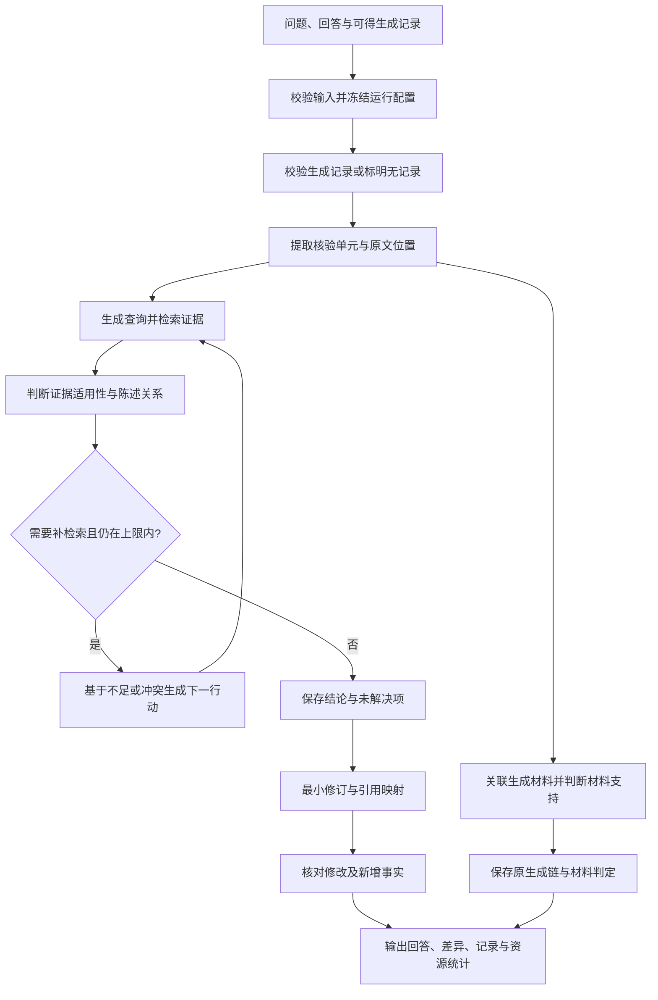

# 模型生成过程追溯与回答证据验证 Agent：需求分析

版本：v0.1（需求讨论稿）  
日期：2026-10-06  
状态：基于当前项目资料与用户已确认方向形成；未确认的实现选择不视为已批准。  
配套文档：[验收用例](验收用例.md)。

## 1. 结论与项目定位

本项目建设一个**生成过程追溯与回答证据验证 Agent**。用户已明确首版面向通用事实性回答，同时需要两项核心能力：①追溯模型生成回答时可观察的提示、上下文材料、检索与工具调用；②生成后独立寻找证据，判断回答陈述的支持程度，在需要时补检索并修订回答。

项目应接收或采集与回答关联的生成记录，检查记录链与材料支持关系，同时建立独立的事后核验链。两条链共享陈述ID，但来源类型、时间、结论和消耗分别记录，最终合并展示。

核心价值是降低人工追查生成依据、逐句查证和修订的成本，让用户能够检查“生成时实际记录了什么、回答与材料是否相符、独立证据是否支持事实、哪些仍然不能确定”。用户仍保留是否采用修订的决定权。

系统首先评价**陈述在指定来源、时间和检索范围内获得的证据支持程度**，不把它包装成能保证一切现实事实正确的裁判。面向课程项目，还需证明检索核验相对于原回答和无证据自检的收益，并披露误改、内容损失、成本及失败条件。

RARR 是回答后修订的候选方法参考，SAFE 是候选核验参考，FActScore 是候选评估参考。它们不覆盖全部生成过程追溯需求。项目不绑定其中任一方法；后续若采取方法复现，应单独列明忠实保留的部分、接口或数据替换、过程追溯等产品扩展及与原论文的差异。

建议首版采用单任务、文本回答、一种结构化生成记录导入格式、一个可用的独立检索模式、一个核验模型适配和有界补检索；受控生成采集作为下一阶段接入。导入真实记录可以先满足追溯，不必同时搭建通用生成平台。若现有平台无法提供记录，应优先接入一个受控生成入口，以获得真实可验收记录。采集路线待确认，不代表已获准安装、付费调用或发布。

## 2. 依据、状态和使用方式

### 2.1 需求依据

| 编号 | 依据 | 用途与限制 |
|---|---|---|
| S1 | 用户确认：生成过程追溯与生成后独立事实核验都需要；首版通用事实性回答、低领域门槛样例 | 最高优先依据；扩展历史交接仅描述的事后核验链，覆盖把RARR或课程资料领域当作最终定位的表述 |
| S2 | [项目交接](../handoff/项目交接_RARR事实核验与回答修订.md)，重点第2、4、5、6、7节 | 确认目标、展示内容、语义边界、课程背景及未决事项；其中实验数量和技术路线包含历史建议 |
| S3 | [课程要求提取](../course/NLP_实验与项目要求提取.md)，重点第四、五节及 ch16 摘录 | 课程期末项目的交付与可复现依据；不将四次独立作业要求整体转化为本项目硬要求 |
| S4 | [第16讲本地快照](../course/snapshots/ch16.txt)，网页第32、33、34、37、42页 | 核对评分、报告、演示和时间口径；快照不是已向教师确认的具体日期 |
| S5 | [项目 README](../../README.md) | 当前目录、模块职责和工程状态；目录存在不代表功能已实现 |
| S6 | 本文第19节列明的论文页面与作者仓库说明 | 核对参考方法的用途；本次未完成论文全文与所有代码的逐节审计，也未运行作者代码 |

### 2.2 状态与优先级

本文使用四种来源状态：**已确认**（用户或项目目标明确）、**课程要求**（资料明确）、**设计建议**（本次分析提出的产品或工程细化）、**待确认**（缺乏必要输入）。设计建议可用于后续方案讨论，但不应描述为用户已要求或课程强制要求。

优先级用于建议实施顺序：**P0** 为形成可用、可解释、可验收链路所必需；**P1** 为完整课程版本的重要能力；**P2** 为后续扩展。优先级不等于课程评分百分比。

本次产出只完成需求分析与验收设计。各功能当前均未实现，文中的“应”是目标行为。质量阈值和性能数值将在试验后冻结；本文不声称已测得效果。

## 3. 目标用户、问题与成功标准

### 3.1 用户与利益相关方

| 角色 | 典型任务 | 主要诉求 | 建议覆盖范围 |
|---|---|---|---|
| 使用模型回答的学生或研究者 | 核查学习、资料整理和写作中的事实陈述 | 减少查证时间，保留可用信息，能打开证据复查 | 首版主要用户；实际招募对象待确认 |
| 评估与标注人员 | 对固定样本标注、比较基线与系统结果 | 统一规则，证据快照稳定，误改与漏检可定位 | 课程完整版本 |
| 项目成员 | 调试模型、检索、修订和成本 | 每一步可追踪，服务可替换，失败可复现 | 首版开发与实验使用 |
| 任课教师及答辩评审 | 检查价值、设计、代码与实验 | 系统可运行、结果可核对，贡献与AI使用清楚 | 课程交付 |

首版不建议将医疗诊断、法律判决、投资决策等高领域门槛任务作为主要验收领域；若后续选择专业方向，需增加相应来源规范和专家标注，不能仅沿用通用样本的指标。此处是产品范围建议，不是对用户使用的额外限制。

### 3.2 业务目标

| ID | 目标 | 可观察的成功标准 |
|---|---|---|
| G1 | 让回答依据透明 | 每个已处理事实陈述有结论、依据或明确不足说明，可分别定位生成时材料与事后证据 |
| G2 | 修复可证实的问题 | 在固定评测集上相对原回答报告支持程度和错误修复的变化 |
| G3 | 保留原回答有用内容 | 同时报告原本支持内容的保留、误改、删除和回答完整性 |
| G4 | 呈现不确定性 | 缺证据、来源冲突、未完成核验和服务故障可区分 |
| G5 | 控制自主行动 | 检索与重试有可配置上限，停止原因可见，产生的调用可追踪 |
| G6 | 支撑课程复查与答辩 | 固定数据、基线、参数实验、版本记录、失败分析与演示材料完整 |
| G7 | 生成过程可追溯且不伪造 | 可按事件重建已观察的输入、工具与输出；缺口及记录来源可见；不声称还原内部真实推理 |

产品价值指标可在后续小规模用户观察中比较“人工查证耗时”和“接受修订所需操作数”；未做此类观察前，不宣称实际节省了某个比例的时间。

## 4. 范围与版本边界

### 4.1 建议的最小可用版本

1. 接收问题、原回答与可得的生成记录，保存原文、记录来源与独立核验范围；无记录时明确降级。
2. 校验生成事件链，提取实际提供给模型的材料；将回答组织为带原文位置的核验单元。
3. 将陈述关联到生成材料并判断材料支持关系，区分原有引用、观察到的上下文包含和事后推断匹配。
4. 自动生成查询并调用一种真实的事后检索来源；可选择公开网络或独立指定的本地参考资料。
5. 保存真实证据片段、来源、时间和定位信息，逐项给出独立核验结论及简短依据。
6. 基于反馈判断是否补检索，在上限内改写查询或寻找另一来源。
7. 按核验结果做最小必要修订，输出差异，复核修订产生的新事实。
8. 分开显示原生成链、事后验证链及支持结论，展示未解决项、停止原因和调用统计，导出可复查记录。
9. 用冻结的生成记录与证据样例验证规则；模拟结果明确标识，不能作为真实运行成绩。

仅固定“一次检索后生成回答”的程序可以作为前期基线；用于最终展示的 Agent 应能根据真实反馈选择有界的后续行动。是否使用工具调用协议或框架属于技术方案，不是需求本身。开发本文件时使用多个子 Agent，与产品是否采用多智能体无关。

### 4.2 完整课程版本与扩展

| 版本 | 建议能力 | 说明 |
|---|---|---|
| MVP / P0 | 标准生成记录导入、事件与材料追溯、无记录降级、独立核验、有界补检索、最小修订、异常处理及简单展示 | 至少一条真实记录与真实独立检索结合的链路可运行 |
| 课程完整版本 / P1 | 受控生成采集（按记录可得性提前）、批量评估、三个基线组、至少一组参数实验、人工校准、错误分析、报告与答辩 | 分别评价追溯与事实核验；部分来自课程要求 |
| 扩展 / P2 | 第二检索模式、多模型或多语言、领域来源库、人工调整再核验、长期任务管理 | 不应挤占核心评估和复现时间 |

### 4.3 首版不纳入的范围

通用回答生成平台、通用聊天记忆、模型训练或微调、多智能体协商、用户账户与团队权限、联网发布、多租户服务、大规模爬虫、浏览器插件、图片音视频核验，均不作为首版必须功能。采集一个受控生成入口与建设通用生成平台不同；外部平台回答只有实际提供可观察记录时才能追溯其过程。

不能仅凭回答恢复未记录的提示、工具调用、训练数据出处或模型内部推理。模型解释、公开的推理摘要或token概率即使可得，也不自动构成内部因果证明；首版不要求采集这些信息。

首版不默认解析任意 PDF、Word 或扫描件。若选择本地证据模式，先约定文本、Markdown 或已提取的课件文本等可支持格式，再由技术方案确定是否扩大范围。

## 5. 核验对象与语义规则

### 5.1 三层证据与追溯边界

| 层次 | 回答的问题 | 结论边界 |
|---|---|---|
| 生成过程记录 | 采集范围内接收什么输入、调用什么工具、返回什么材料、产生什么输出？ | 有日志不等于全部内部行为被记录；外部导入日志真实性未自动验证 |
| 生成材料支持 | 实际进入上下文的材料是否支持回答陈述？ | 材料可能错误；进入上下文只表明模型有机会看到，不证明具体句子的真实因果来源 |
| 事后独立证据 | 与原生成材料分开获取并审查的证据是否支持陈述？ | 指定范围内的支持程度，不保证所有时点的现实事实正确 |

同一陈述可以“生成材料支持、独立证据矛盾”，也可以“没有生成记录、独立证据支持”。事后检索所得来源不能补写成生成时实际使用的来源。

关联依据类型建议为 **observed**（实际记录的请求/材料发送）、**declared**（原回答或生成端声明引用）、**inferred_match**（事后语义匹配），而非可信度分数。声明引用仍须核对是否匹配。材料缺失应说“记录中未见”，不直接推断现实中不存在或原平台从未使用。

追溯完整性状态为 complete_within_scope、partial、coverage_unknown、absent、invalid。complete仅相对于采集清单的边界，不称“模型全过程完全还原”。scope_manifest至少定义必采事件类型、观察链起止、允许缺失项、采集器版本和可得的独立事件计数。另分别记录结构校验、覆盖校验、来源和保存后完整性校验。

没有悬空ID只能说明“结构无已知缺口”。如果请求与返回整对被删，且没有独立计数或其他参照，系统未必能检测；此时coverage_unknown，而不是宣称完整。外部导入的完整性声明标为用户/平台声明，不能自动升级为已验证。文件hash可检测保存后变化，不能证明首次写入日志真实。

### 5.2 核验单元

核验单元应尽量只包含一个可以独立判断的事实命题，并保留实体、数量、否定、时间、地域、条件和来源限制。例如“某项目必须4人且报告不少于5000字”应拆为两个单元；“截至某年”不能在拆分或修订时丢失。

指代消解后的陈述必须能回指原文，不能凭模型猜出未知实体。一个原文片段可对应多个陈述；重复陈述可以共享证据，但须保留所有出现位置。事实与建议混合的句子应仅核验事实部分，观点、个人偏好、创作文本和无法定义外部证据的价值判断不强制判真伪。

### 5.3 结论与处理状态分离

以下为本项目的**建议标签体系**，不是 RARR、SAFE 或 FActScore 原方法的原样实现。

生成材料支持与事后独立核验各保存一份判定，后验步骤不得覆盖生成材料标签。无生成材料时标记材料核验未开展，不将absence当成已检索后的insufficient。

| 核验结论 | 语义 | 使用条件 | 禁止的推断 |
|---|---|---|---|
| supported / 有证据支持 | 在声明的证据范围内，存在适用且直接支持陈述的证据 | 主体、时间、条件和量词匹配；未存在尚未解决的适用反证 | 支持不等于所有现实情况均已证明 |
| contradicted / 与证据矛盾 | 适用证据直接否定命题或给出不相容事实 | 例如“必须4人”与规则“2–4人可组队”不相容 | 不能把仅未提及该事当成否定 |
| insufficient / 证据不足 | 生成层：已有材料已审查但不足；后验层：执行约定范围检索后仍不足以支持或反驳 | 无关、仅部分支持、指代不明或时间不适用；无生成材料为未开展而非不足 | 不得显示“错误”或“已证伪” |
| conflicting / 来源冲突 | 存在同一主体、条件和时间范围内不可兼容的有效证据，且未能解决 | 不同口径适用性仍不确定，或双方均适用 | 不能多数投票或任意选一个来源作为真值 |
| not_applicable / 不适用 | 当前单元不在事实核验范围 | 观点、建议、假设、不可检验表达 | 不计入事实支持率，也不能作为满分依据 |

处理状态单独记录为 pending、running、completed、skipped 或 failed。未检索、未轮到、被取消、预算停止和全程工具失败的陈述，**不能仅因没有证据就自动标成 insufficient**；显示未完成状态与原因。部分有效检索后仍无法判定可给 insufficient，同时记录流程是否完整结束。

区分“不同时间版本”与“同一时间冲突”：旧规则和新规则可以是变更而非冲突；若无法确定生效日期则保留不确定性。来源优先级应针对任务配置，发布日期较新不自动推翻旧事实，主站域名也不自动保证片段适用。

### 5.4 修订规则

| 输入结论 | 建议修订行为 |
|---|---|
| supported | 保留事实和原有条件，补充引用；不为统一风格大幅改写 |
| contradicted | 仅在证据支持替代事实时更正；否则移除错误断言或改为待核实，并记录原因 |
| insufficient | 避免作为已确认事实输出；可限定为“在本次证据范围内未找到依据”，或删除断言并在未解决清单中保留 |
| conflicting | 展示来源各自口径、时间和适用范围；未解决前不给单一确定结论 |
| not_applicable | 默认保留，不因不能事实核验而删除观点 |
| 未完成核验 | 明确标注未核验；若保留在修订回答中，应让该标记与具体片段对应 |

修订以事后独立证据为主要事实更正依据，同时说明与原生成材料的差异。修订是派生运行，原生成记录不可改写；新调用、新材料和修改单独关联。

修订后新增的实体、数字、时间、因果、限制条件都要作为新事实检查，不能直接继承原陈述的标签。为避免修订—核验循环无限运行，终检若仍不通过，应降级为保守结果、原回答加注或修订失败，并保存候选草稿；不能发布“全部验证通过”。

解释只需呈现陈述、证据及简短判定理由，记录可观察的行动、参数与结果。需求不要求索取或存储模型隐藏的内部推理链。

## 6. 主要使用场景

| ID | 场景 | 用户期望 | 核心验收关注点 |
|---|---|---|---|
| UC01 | 正确和错误事实混在一段回答 | 更正有证据的错误并保留正确部分 | 拆分不漏条件，最小修订，无新增无据事实 |
| UC02 | 回答含无法找到依据的要求 | 得知本次未找到支持，而非被告知一定不存在 | insufficient 与 contradicted 分开 |
| UC03 | 两份来源对同一事项给出不同说法 | 看到冲突及适用时间，不被强行给出日期 | conflicting 或有证据的版本变更解释 |
| UC04 | 首次结果无关或不完整 | 系统换查询或来源，达到上限后解释停在哪里 | 自主行动基于反馈、有界、可追踪 |
| UC05 | 回答全部已有依据 | 原内容基本保留并附来源 | 不为了展示修订而制造变化 |
| UC06 | 服务报错、额度不足或用户停止 | 获得已完成部分和准确任务状态 | 工具故障不伪装成事实结论 |
| UC07 | 项目成员批量比较方案 | 同样本、同原回答、完整日志及结果汇总 | 控制变量、失败样本不被丢弃 |
| UC08 | 答辩演示与离线复查 | 一般用例和难例可展示，断网仍能回放保存结果 | 实时执行、证据回放、录屏明确区分 |
| UC09 | 已有生成日志，需要查回答依据 | 看到真实提示、工具事件和材料，与陈述关联 | 可观察事实与推断关联分开；不猜训练来源 |
| UC10 | 只有回答，生成记录不可得 | 仍可事后核验，但知道无法追溯原生成过程 | 不编造日志、不把事后证据冒充原来源 |
| UC11 | 工具材料包含错误，回答照抄 | 发现生成材料支持但独立证据矛盾 | 两份判定同时存在，修订更正且保留原链 |
| UC12 | 日志缺失、篡改或来源未知 | 看到记录缺口、校验失败和真实性限制 | 完整性、保存后完整性与原始真实性分开 |

## 7. 主流程、状态与停止条件

运行状态建议为 created → validating → trace_audit → extracting → material_check → researching → revising → final_check → completed / partial / failed / cancelled。无记录时trace_audit与material_check明确跳过而非伪造。生成追溯与事后核验有独立子任务状态；一种能力失败不应抹去另一种能力的有效结果。总状态表达已请求能力的完成情况。状态含义如下：

- completed：约定流程完成，所有处理项有状态；仍可包含证据不足或冲突，完成不等于“回答全真”。
- partial：存在由于限制或故障未完成的核验单元，但已有可复查结果；必须列出未完成项。
- failed：输入、配置或关键阶段故障，无法产出有效完整结果；保留可恢复的记录。
- cancelled：用户请求停止，不能显示正常完成；保留此前已持久化结果。

默认请求“追溯＋独立核验”：无原生成记录时追溯子任务为skipped/absent，独立核验可为completed，总状态为partial，并明确原因是追溯不可得；coverage_unknown只表示验证范围局限，若已完成约定审查可完成子任务，但局限持续显示。若用户明确只请求事后核验，则追溯skipped，独立核验完成后总状态可为completed；各入口使用相同聚合规则。

建议记录的停止原因：evidence_sufficient、max_rounds、max_search_calls、max_model_calls、token_limit、cost_limit、deadline、no_new_evidence、provider_failure、user_cancelled。原因与具体阶段和核验单元关联，不只显示一个总错误弹窗。

下一个行动只能来自受控动作集合，例如换查询、扩大关键词、核对另一来源、停止并报告。模型建议须由程序验证后执行；工具实际返回的成功或失败决定后续状态。预算、超时、最大轮数由程序强制执行，不能交给模型自行保证。

## 8. 功能需求与验收口径

以下均是待实现需求；来源栏区分目标本身与本次建议的实施细化。AC 编号对应配套验收用例。

### 8.1 生成过程追溯需求

| ID | 优先级 | 来源状态 | 需求与可检查行为 | 验收 |
|---|---|---|---|---|
| TR01 | P0 | 已确认＋设计建议 | 导入一种结构化生成记录，先本地校验字节、事件数、单项长度、关联深度与认证字段；保存通过检查的原包、格式/映射版本、边界、来源及缺口；非法不补造、不静默截断 | AC21、AC23、AC20 |
| TR02 | P1（必要时提前） | 设计建议 | 接入一个受控生成入口，记录实际可得的提示、模型参数、上下文、工具请求/响应、最终输出、用量与失败；提供采集边界；不强制所有厂商格式兼容 | AC22 |
| TR03 | P0 | 已确认＋设计建议 | 校验事件ID、顺序、父子/调用关联、请求返回和最终回答一致性，提示缺口、重复ID、悬空引用和不匹配；并发只要求因果顺序，不虚构全序 | AC21、AC23 |
| TR04 | P0 | 已确认＋设计建议 | 展示生成事件时间线；从陈述定位原有引用、真实材料及其进入上下文的记录；关联类型标为observed、declared或inferred_match | AC21、AC24 |
| TR05 | P0 | 已确认＋设计建议 | 区分“检索返回过”“实际送入模型上下文”“答案声明引用”“事后匹配”；检索命中但未提供的内容不能自动当作生成材料 | AC24 |
| TR06 | P0 | 已确认 | 生成材料支持与事后独立核验分开记录和展示；材料错误时可以得出不同结论；新证据标记事后来源 | AC25 |
| TR07 | P0 | 设计建议 | 无记录时显示absent，保留纯事后核验能力；部分记录仅审查已知范围；不可推测并填充未知提示、工具调用、训练来源或内部推理 | AC23 |
| TR08 | P0 | 设计建议 | 原生成记录和回答不可变，修订形成派生链；保存内容hash和校验结果，明确外部导入真实性未验证及hash的有限作用 | AC23、AC25 |
| TR09 | P0 | 设计建议 | 认证秘密为禁止持久化字段，识别到后拒绝导入且不复制原包；其他合法敏感信息受限本地保存并脱敏展示/导出；外发最小片段，记录不得触发执行 | AC19、AC20、AC26 |
| TR10 | P1 | 设计建议 | 批量评价记录结构完整性、缺口检测、材料关联与材料支持判定，不将事件多或来源多当作效果提升 | AC17、AC21—AC25 |

### 8.2 生成后的独立证据验证需求

| ID | 优先级 | 来源状态 | 需求与可检查行为 | 验收 |
|---|---|---|---|---|
| FR01 | P0 | 已确认＋设计建议 | 输入问题与已有回答，可附关联生成记录；拒绝空白及超过配置上限的内容；运行前提示异常，未通过不得消耗外部调用 | AC01、AC21 |
| FR02 | P0 | 设计建议 | 显式记录证据模式、语言、核验参考时间、修订策略及运行上限；不可用服务在执行前报告；首版只需实现一种来源模式 | AC01、AC12 |
| FR03 | P0 | 已确认＋设计建议 | 提取核验单元，保留原文位置、实体与限定条件；非事实表达及重复项明确处理 | AC02、AC06 |
| FR04 | P0 | 已确认 | 根据核验单元生成查询，实际检索证据；记录查询、参数、返回结果和失败；不以模型生成文本代替外部证据 | AC03、AC10 |
| FR05 | P0 | 已确认＋设计建议 | 保存可定位证据：来源地址或文档ID、片段、段落位置、时间、快照标识；缺正文或仅有搜索摘要时标明证据层级 | AC03、AC18 |
| FR06 | P0 | 已确认＋设计建议 | 给出第5节的结论与处理状态、简短依据及关联证据；直接支持、矛盾、缺失、冲突和未处理分开 | AC03—AC05、AC13 |
| FR07 | P0 | 已确认＋设计建议 | 证据不足、无关或冲突时决定补检索；新行动说明目标并区别于历史查询，去重；触及上限时停止 | AC07、AC12 |
| FR08 | P0 | 设计建议 | 检查来源适用时间、主体和规则范围；不同镜像或同文转载不视为多份独立证据；不能靠来源数量消解冲突 | AC05、AC08 |
| FR09 | P0 | 已确认＋设计建议 | 根据核验结果做最小修订，记录更正、限定、删除、补引用及未解决项；保持原问题的回答方向和原有正确条件 | AC03—AC06、AC09 |
| FR10 | P0 | 设计建议 | 建立原文—原陈述—证据—修改—最终陈述映射；最终引用必须指向真实保存的证据；新增事实终检失败时降级 | AC09、AC10 |
| FR11 | P0 | 已确认 | 展示原回答、生成时间线、生成材料支持、事后查询与独立结论、差异和修订回答；可展开详细证据；状态和未解决项清晰 | AC14、AC21、AC25 |
| FR12 | P0 | 已确认＋设计建议 | 展示耗时、token、调用及成本；原生成、追溯审查、事后核验和修订分阶段汇总，导入历史费用不混成本次新增费用；未知计费项不填0 | AC15 |
| FR13 | P0 | 设计建议 | 保存结构化运行报告与配置版本，至少可导出JSON记录和便于阅读的结果；复查无需重新调用模型 | AC16 |
| FR14 | P0 | 设计建议 | 模型输出不合法时有限重试；检索失败、限流或超时有明确异常；已成功步骤不因整条重试而无条件重复收费 | AC11、AC12 |
| FR15 | P0 | 设计建议 | 支持停止任务并保存已完成结果；控制未来调用，说明在途调用可能已产生费用；停止后不再启动新步骤 | AC13 |
| FR16 | P1 | 课程要求＋设计建议 | 固定输入集批量执行，逐样本留存状态与结果；单条失败不使其他样本无记录；有效与失败数量分别汇总 | AC17 |
| FR17 | P1 | 课程要求＋设计建议 | 对同样本执行原回答、无外部证据自检、证据验证修订三组；输出可核对的指标表与至少一组参数实验 | AC17 |
| FR18 | P1 | 课程要求＋设计建议 | 人工复核、错误归类与AI评委校准独立记录；人工标签不能静默覆盖系统原标签 | AC17 |
| FR19 | P1 | 设计建议 | 基于冻结证据重算或提供历史案例回放入口；P0的FR13仅要求读取已保存报告，不要求回放引擎；实时、重算、读取及模拟不混用统计 | AC16、AC18 |
| FR20 | P2 | 待确认 | 增加第二检索模式、领域来源配置、人工调整陈述与再核验；每次调整形成新版本而非覆写旧报告 | 后续定义 |

## 9. 数据需求与逻辑实体

以下是接口设计必须表达的信息，不限定数据库、JSON字段命名或持久化框架。首版可以采用文件存储，后续再决定是否需要数据库。

| 实体 | 必要信息 | 关系与约束 |
|---|---|---|
| Run / 运行 | run_id、schema_version、问题、不可变原回答、输入来源、创建与结束时间、状态、模式、配置快照、停止原因 | 一次运行有多项陈述与行动；同样本不同方案必须有不同run_id |
| GenerationTrace / 生成记录 | trace_id、原生成任务/平台、采集方式、scope_manifest、格式与采集器版本、原始包hash、完整性状态、原回答hash、验证局限 | 与本次Run关联；外部导入真实性独立标识；不能将后验事件回填成原事件 |
| TraceEvent / 事件 | event_id、parent/link_id、类型、阶段、可得时间与序号、请求/响应、模型参数、状态、工具名、来源请求ID | 区分原生成与后验阶段；时间未知不补造；并发依赖用关联关系表达 |
| GenerationMaterial / 生成材料 | material_id、所属事件、原始来源和片段、定位、内容hash、是否实际进入上下文及观测依据 | 命中但未发送的材料分开；没有实际来源不伪造URL |
| ClaimMaterialLink / 关联 | claim_id、material_id、关联类型、原引用位置、匹配依据、材料支持判定、处理状态 | 关联不能变成未经证实的内部因果结论 |
| Claim / 核验单元 | claim_id、规范化文本、原文位置列表、主体、时间条件、可核验性、提取版本 | 原文位置使用明确坐标规范；保留输入文本后偏移不得随界面格式化变化 |
| SearchAction / 检索行动 | action_id、claim_id、query、来源模式、轮次、参数、触发原因、执行状态、起止时间 | 一次行动可返回0至多条证据；真实失败不是“查询成功但无证据” |
| Evidence / 事后证据 | evidence_id、来源URL或文档ID、标题、原始片段、定位、获取时间、可用的发布/生效时间、内容hash、摘要或正文标志 | 与生成材料独立标识；可以支持多条陈述；没有时间信息时保存未知 |
| Verdict / 判定 | claim_id、layer（generation_material / posthoc_independent）、判定版本、结论、处理状态、关联材料/证据ID、依据、局限、时间 | 层次不可混用；不得使用不存在的ID；历史轮次不可静默覆盖 |
| Revision / 修订 | 修订文本、修改类型、原文位置、原claim_id、最终claim_id、证据ID、修改理由、终检状态 | 删除项也留痕；一对多、多对一、新增和保留均能表达 |
| Usage / 资源记录 | 调用ID、服务和模型、请求状态、token、调用次数、延迟、费用、币种、计价版本、统计完整性 | 失败或重试的已知消耗计入总数；未知与0分开 |
| EvaluationSample / 样本 | sample_id、问题、原回答、来源类型、语言、参考证据版本、原始人工陈述及标签、数据划分、备注 | 自然生成和人工植错分开；提示例、调试集和测试集不能混用 |
| Annotation / 标注 | 标注人匿名ID、陈述/引用对象、标签、依据、规则版本、时间、分歧与仲裁 | 保留独立标注，不以仲裁结果抹去原分歧 |

证据正文、清洗文本和供模型使用的截取片段应可关联，清洗不能损失否定、表格行列、日期与单位。若表格转文本无法保持语义，应标明不可可靠提取而非自动据此判定。

用户引用原有证据可作为线索，但仍要确认实际片段；给出的URL不能因为是输入的一部分就自动当作可信证据。模型自己的输出、拟造引用、历史修订结论和训练记忆不是外部证据。

**原文绑定与坐标约定：**原回答按UTF-8解码文本保存，不做换行或Unicode规范化；answer_hash计算无BOM的UTF-8编码文本字节。原文位置为Unicode码点的零起点半开区间[start,end)，不是UTF-16代码单元。JSON编码层的转义不影响解码后绑定。中文、emoji、CRLF/LF差异需要测试；若进行规范化或脱敏，生成新版本、独立展示hash及位置映射，不重新用展示文本冒充原回答绑定。

**原包保存边界：**先本地检查禁止保存的认证字段，发现密钥/令牌等即拒绝导入，不向模型发送，也不在本应用管理的存储中复制原包。用户原有源文件不由应用自动删除。其他允许保留的个人或内部资料可受限保存，展示与公开导出脱敏；“保存原包”的要求仅适用于通过这一检查的包，不能同时声称秘密被保留和从未持久化。

## 10. 交互与结果表达

建议首版采用一个简单页面：输入问题、原回答、可选生成记录和核验范围；开始后显示阶段、已处理数量、调用统计及停止按钮。完成后展示两部分：原生成链及记录完整性、材料支持；事后证据验证及修订差异。共享陈述列表，但两层结论分栏，提供导出入口。具体框架待选型。

结果摘要至少给出：生成记录有无、采集范围、来源/校验状态与缺口；已提取事实数量、每层已完成数量与标签分布、未核验数量、是否修订及运行状态。支持率的分母和覆盖率须一同展示，不能用“80%可信”代替具体口径。

核验详情能从一个陈述跳到原文片段、查询历史、支持与反驳证据及修改理由；来源链接有标题、定位和时间，不能仅展示一个网站首页。差异展示至少区分保留、删除、替换和新增；不依赖颜色才能读懂。

面对 partial、failed 和 cancelled，页面保留已完成结果并突出未完成项。没有修订或修订失败时不让最终回答区域显示空白而无解释。成本信息应称“已记录费用”或“估算费用”，不能在计费不全时宣称精确账单。

## 11. 非功能需求

| ID | 优先级 | 来源状态 | 需求与验收标准 |
|---|---|---|---|
| NF01 可追溯性 | P0 | 已确认＋设计建议 | 每个成功结论及更正有有效证据映射；原回答、配置和快照不可被后续运行覆盖。AC03、AC09、AC16 |
| NF02 有界执行 | P0 | 设计建议 | 时间、步数、调用和token上限外置；新调用前检查配额，停止后不继续排新调用。在途调用和真实计费误差明确披露。AC12、AC13 |
| NF03 异常可靠性 | P0 | 设计建议 | 超时、限流、非法结构与服务不可用能收敛到明确状态，不能无限重试；已保存结果可读取。AC11—AC13 |
| NF04 可复查与可复现 | P0/P1 | 课程要求＋设计建议 | 记录模型与提示版本、解码参数、数据版本划分、种子、评分脚本、代码提交、配置和证据hash；固定快照可复查。外部API不保证逐字一致，须披露非确定性。AC16、AC17 |
| NF05 可维护性 | P0 | 设计建议 | 模型/检索适配与核验语义解耦；不同入口复用核心；配置有验证与默认值；更换服务不改变报告语义。方案评审及核心接口测试 |
| NF06 易用性 | P0 | 已确认＋设计建议 | 用户无需读日志就能看到依据、差异、未解决项与阶段；错误提示有可执行的下一步；键盘操作可完成主要流程。AC14 |
| NF07 隐私与数据边界 | P0 | 课程要求＋设计建议 | 密钥不入库、日志和导出；用户输入会发给哪个外部服务有说明；公开样本脱敏；原回答默认本地保存，不自动上传或共享。AC19 |
| NF08 工具与证据隔离 | P0 | 设计建议 | 证据内容仅作为资料，不可修改工具权限或运行配置；获取URL拒绝本机/内网目标与危险协议，重定向后再次检查；本地文档读取限定已选目录。AC20 |
| NF09 性能与部署 | P1 | 待确认 | 目标硬件、允许联网、单条延迟及费用上限需试验后定；冻结后报告p50/p95耗时、完成率、峰值资源和服务限流。未测前不承诺固定速度 |
| NF10 依赖与来源管理 | P1 | 课程要求＋设计建议 | 记录依赖版本和数据/参考代码来源；引入第三方代码前确认许可证；证据快照按用途保留，不默认整体公开。干净环境验证及发布前资料检查 |
| NF11 追溯真实性边界 | P0 | 已确认＋设计建议 | observed、declared与inferred_match不得互相冒充；完整性仅对应采集范围；外部导入不因格式或hash正确就称来源真实。AC21—AC25 |
| NF12 记录隐私与生命周期 | P0 | 设计建议 | 原始提示可能含秘密；展示/导出可脱敏且保留关联；原始包不提交Git；删除运行记录时按依赖清单处理快照与缓存，共享材料不误删。AC26 |
| NF13 关联一致性 | P0 | 设计建议 | trace_id、answer_hash和输入回答必须匹配；用户修改后形成新版本，不能沿用旧回答的来源匹配与判定。AC21、AC23 |

本项目的工具动作主要为检索和本地记录，不需要发邮件、执行任意命令、改写来源网站或产生外部业务动作。模型生成的工具参数必须通过程序验证。不得因“多轮思考”而默认扩大权限。

### 11.1 资源预算建议

至少支持配置：输入长度、导入文件字节、事件数量、单事件/材料长度、关联深度、最大事实单元数、候选证据数、每陈述轮数、总检索调用、模型调用、token、任务时限、重试与可选费用上限。循环关联和超限记录在有限本地解析时间内拒绝，零外部调用，不静默截断。具体值根据服务能力和预算确定。

首版建议顺序执行或采用低并发，避免多条任务同时越过全局预算。批量任务还应有整个实验的预算上限。若计价表不可用，则明确无法严格按金额预控，仍按调用数和token限制运行；完成后标注费用不完整。

## 12. 证据来源路线与方法选择

| 维度 | 公开网络检索 | 指定本地文档 |
|---|---|---|
| 适用任务 | 来源分散、需要跨页面查证的公开事实 | 对给定资料的支持程度、规则核对、离线实验 |
| 优势 | 更贴近一般模型回答的外部查证 | 证据范围可控、定位和快照稳定 |
| 主要困难 | 结果随时间变化、来源质量差异、费用及网络依赖 | 文档覆盖不足、切块损失语义、不能把库外未知判假 |
| 评估口径 | 指明检索时间与允许来源；参考证据独立整理 | 指明资料版本与封闭范围；不可声称覆盖全网事实 |
| 首版工作 | 搜索适配、真实内容获取、证据定位与快照 | 文档读取、适当检索、文档/段落定位与版本保存 |
| 当前状态 | 待用户选择与服务验证 | 待用户选择与格式约定 |

这里的选择是**事后独立证据的获取方式**，不同于已经确认要做的生成痕迹追溯。生成记录中的检索工具可以来自原生成系统，并不决定本项目后验检索的来源模式。独立性指验证过程不直接采纳原判定，且证据范围和获取过程明确；同一权威来源可再次审查，但须说明同源性，不能夸大为独立事实真值。

设计建议：接口支持替换，但首版只实现一种事后检索模式，避免同步建设搜索、文档解析、向量索引和混合检索。可独立使用冻结的证据夹具进行测试与回放；夹具不等于实现第二种真实检索模式。

选择参考方法时至少比较：与目标链路的覆盖关系、中文适配、证据与引用可追踪程度、内容保留机制、实验可比性、服务依赖和代码许可。确定后输出“方法步骤—实现模块—替换/扩展—验证方式”对照表，不能在需求阶段就声称完成严格数值复现。

## 13. 评估需求

### 13.1 过程追溯、材料支持与独立核验分开评估

**生成追溯评估**：用真实采集记录及明确标为夹具的缺失/修改记录，评估导入、事件关联、完整性检查和材料匹配。人工参考需标明实际送入模型的材料、原有引用和仅可推断的匹配；没有此类记录不能评价“真实生成来源恢复率”。

**生成材料支持评估**：检查记录中的材料与陈述是否相符，标签由人工基于生成材料标注。它衡量回答对其输入的忠实程度，不评价材料自身真实性。

| 追溯指标 | 分子 / 分母与边界 |
|---|---|
| 结构解析通过率 | 可按约定格式解析的记录包数 / 导入记录包数；解析成功不表示内容真实 |
| 可观察事件覆盖率 | 实际捕获的应采集事件数 / 受控夹具或人工确认范围内应采集事件数；外部日志未知缺失数量时N/A |
| 缺口检出率与误报 | 正确发现的人工植入缺口 / 植入缺口总数；同时报告完整记录被误报的数量 |
| 关联精确率/召回率 | 陈述—材料关联与人工关系对齐；引用解析、上下文观测和推断匹配分组，不把语义近似计为因果来源 |
| 生成材料支持判定 | 人工材料标签的混淆矩阵与P/R/F1，独立于事后核验统计 |
| 双层结论差异 | 材料与独立核验标签不同的陈述数及案例；用于诊断，不以差异少作为正确指标 |
| 追溯降级正确率 | 无记录、部分记录和格式错等场景正确呈现状态的案例数 / 对应案例总数 |

不使用“恢复模型内部推理准确率”“训练数据来源定位率”等不可定义金标准的指标。日志数量和长度不作为质量得分。

**固定参考评估**：由标注人员在约定来源范围与时间内整理冻结参考证据、原始陈述及判定，作为比较基线、检测错误和评价修订的共同参照。各方案使用同一参考标准；测试标注不作为模型输入，不为某个方案临时更改标准。

原参考标注未必覆盖修订新增的事实，因此需预先冻结**允许参考来源、目标时点和补充审查协议**。收集各组最终候选事实，按同一规则去重并隐藏方案身份后统一审查；必要补充参考证据形成新版本和审查记录，重新评分所有组。不得只为某组新增事实补证据，也不得因原金标缺少该事实就自动判不足。离线复算使用最终冻结的同一参考版本，开发过程的版本不能混入同一结果表。

**本次运行证据评估**：检查系统保存的片段是否直接支持本次结论、引用是否有效、覆盖是否充分。这能评价归因质量，但不能用系统自己检索到的材料与自己给出的标签直接证明事实准确率。

开放网络上无法穷尽所有来源；参考结论也是给定范围内的人工判断。争议样本单列，报告分歧和仲裁。现实事实准确性若要作为单独指标，需更严格的领域真值与时点定义，不能从支持率直接换名得到。

### 13.2 数据与标注

EV01（P1，设计建议）：先用20条回答做流程和成本试验，再按预算、标注工作量和观察到的失败类型扩到50–100条；均为建议规模，不是课程硬要求。样本单位是回答，不是陈述条数；两者同时报告。

EV02（P1，设计建议）：首版为通用事实性回答、低领域门槛样例。样本至少覆盖正确与错误混合、全部正确、证据缺失、来源冲突、时间过期、否定/数量/条件、长句与指代；也要包含有/无/部分生成记录及“生成材料支持但独立证据矛盾”。工具故障、植入日志缺口和提示注入另列工程测试集。

自然生成回答与人工植错回答分别统计。人为错误保留修改记录，避免只有容易纠正的错误样本；保留正确事实用来测误改。开发/提示示例/正式测试的划分在实验前冻结，正式测试结果不用于反复选择提示。

EV03（P1，课程要求＋设计建议）：制定陈述拆分、适用时间、证据关系、标签、修改映射和错误类别的标注指南。建议双人独立标注试验集及正式集的预定子集，记录原始标签、分歧、仲裁及指南版本。AI评委可辅助，但需人工校准；不能以系统标签当作人工金标准。

### 13.3 指标口径

下表是**本项目建议指标**，不是直接套用某篇论文的完整公式。若最终采用原论文指标，另行保留原公式、数据和实现差异。

统一约定：事实单元为统计对象；每个回答按固定标注规则拆分。修订前后通过语义映射对齐，不能只按字符串相同判断。原文与修订的支持程度均用同一冻结参考标准评价，运行证据支持另列。

| 指标 | 分子 / 分母及补充口径 | 防止的误读 |
|---|---|---|
| 陈述提取召回率 | 系统正确对应的人工可核验原陈述数 / 人工可核验原陈述总数；按一对一语义匹配规则去重 | 未提取的陈述不能被评价流程自动忽略 |
| 陈述提取精确率 | 忠实表达原回答的可核验提取单元数 / 系统提取的事实单元数；错误补全、重复和观点误提取分开记录 | 提取数量多不等于覆盖好 |
| 核验覆盖率 | 已有效完成核验的系统可核验陈述数 / 系统提取的可核验陈述总数；同时报告提取召回 | 漏提取会使覆盖率看似很高 |
| 四类判定表现 | 固定人工参考陈述上的supported、contradicted、insufficient、conflicting混淆矩阵及各类P/R/F1；未完成和漏提取单列并计入对应真实类别召回损失 | 不把未完成归到不足，不只挑成功样本 |
| 支持比例 | 由人工参考判为supported的事实单元数 / 回答全部可核验事实单元数；报告修订前后及各标签数量 | 这是证据范围内的支持程度，包含不足与冲突在分母；不是现实准确率 |
| 引用支持精确率 | 引用片段在对应语境下确实支持对应陈述的关联数 / 全部陈述—引用关联数 | 正确网页不等于对应引用有效 |
| 引用覆盖率 | 至少有一条有效支持引用的最终事实数 / 最终全部可核验事实数 | 无引用不能靠不计入关联精确率而被隐藏 |
| 错误检出率 | 被系统明确标为contradicted的人工contradicted原陈述数 / 人工contradicted原陈述总数 | 不足和冲突不作为已证伪错误；漏提取/未完成计漏检 |
| 矛盾误报率 | 被系统判为contradicted的人工supported原陈述数 / 人工supported原陈述总数 | 用正确内容作为清晰分母；不足/冲突误报另从混淆矩阵看 |
| 严格错误修复率 | 原本contradicted且在同一事实槽位被有支持的更正替代的原陈述数 / 原本contradicted原陈述数 | 仅删除、泛化或加“可能”不算严格修复；错误与更正不要求语义等价 |
| 错误断言消除率 | 原本contradicted且最终不再被作为确定事实断言的数量 / 原本contradicted原陈述数 | 删除与纠正分别报告，不能将此指标替代修复率 |
| 正确内容保留率 | 原本supported且核心信息与条件在最终回答中仍有支持地保留的数量 / 原本supported原陈述数 | 语义保留而非字符串相同；不支持大幅泛化作为完整保留 |
| 误改率 | 原本supported，修订后被改为无支持或矛盾事实的数量 / 原本supported原陈述数 | 删除单列为信息损失，不混入事实误改 |
| 原事实删除率 | 最终回答中没有对应事实槽位断言的原可核验事实数 / 原可核验事实总数 | 必须给正确事实删除率；对应槽位仍存在但无支持是失败替换，不混入删除 |
| 新增事实支持率 | 新增且获得参考支持的最终事实数 / 全部新增最终事实数 | 改写中的新数字、实体和条件均算新增核验对象 |
| 新增事实率 | 最终无法对齐到原始事实的新增单元数 / 最终全部可核验事实数 | 新事实比例与支持程度一起报告 |
| 回答完整性 | 按问题预设的信息槽位中被有支持地回答的槽位数 / 预设必要槽位数；题型不适用时人工说明 | 文本更短不代表任务完成得更好 |
| 工程与资源 | 有效完成率、部分/失败/取消数量，总及阶段耗时p50/p95、调用次数、token、已知和估算费用 | 重试与失败的消耗计入，结果回放耗时不混入实时耗时 |
| 标注/评委一致性 | 双人独立标签一致数 / 双标项数；另报告类别分布与分歧，可补充Cohen's κ | 系统与自身评判一致不构成人工校准 |

分母为0时输出 N/A 和对应计数，不输出100%或0%假象。未完成样本不只从结果中删除：全样本报告任务完成率、漏检和资源，另列有效样本条件指标。整条失败的样本不能获得默认满分。

对齐不确定的单元标记alignment_unresolved并单列数量，不硬塞到事实标签；冻结匹配及一对多规则。四类混淆矩阵只含已对齐且实际预测项，全流程召回将漏提取、未完成作为损失，未对齐项的处理范围须披露，不混成第五类事实。误改另分“改成矛盾”与“改为失去支持”，正确内容删除单列。

泛化、弱化和丢失限定条件的修改单列信息损失，不能一律算完整保留或完全删除。原contradicted事实槽位被替换为仍无支持的内容，计失败替换；原supported槽位被替换为无支持内容，计误改。通过这些互补统计解释总信息损失。

既报告逐回答的宏平均，也报告按事实单元汇总的微平均；所有N/A项注明平均时的排除规则与数量。指标表同时提供计数，错误修复、保留和引用可以回查到样本及陈述ID。

### 13.4 基线与参数实验

EV04（P1，课程要求＋设计建议）：至少比较 B0 原回答不修订、B1 模型无外部证据自检修订、B2 本项目独立检索核验后修订。同一样本用同一原回答及生成记录，不为某个方案重新生成。B1不提供生成材料或检索证据；B1与B2尽量统一模型、解码参数及修订约束，明确可见信息与流程差异。B0没有新增模型费用，初始生成的历史成本分开记录。

追溯指标与这些修订基线分开；可增加B_trace“仅生成材料检查后修订”，分析材料与独立检索的作用，属可选扩展。B2同时展示追溯结果；若材料影响最终修订，应明确披露，不能把多项变化都归因于单一组件。

EV05（P1，课程要求＋设计建议）：至少一组参数对比，建议选择证据数量或最大补检索轮数，一次只改变一个主变量。其余模型、数据、提示和参考证据固定；网络检索结果变化单独注明。可以增加“无补检索”消融，比较补检索增益与新增费用。

EV06（P1，设计建议）：把实时网络检索实验与冻结检索快照实验分开。缓存是否命中、是否计入延迟/费用统一定义；共享检索结果时注明这是控制证据条件的实验，不能同时宣称测到各组真实检索能力。

EV07（P1，课程要求＋设计建议）：每次正式实验保存模型可获取的具体版本、提示hash、配置、代码提交、数据/划分/标注规则、种子和证据版本。固定种子只能约束可控制部分；对API、模型升级、网络返回的不确定性披露，并按预算决定重复实验次数，不承诺同参数必定逐字相同。

EV08（P1，课程要求＋设计建议）：失败分析至少能定位到提取、查询、检索覆盖、证据适用、关系判定、来源冲突、修订、引用、工具与预算环节。保留真实失败，不只展示成功例；每类提供代表样本与可验证改进建议。

## 14. 验收层次与通过条件

### 14.1 功能验收

配套[验收用例](验收用例.md)中的P0用例均需通过。固定夹具验证规则、状态和故障；模型相关结论需结合人工检查；至少一条真实来源、真实模型的端到端运行证明服务已连通，模拟成功不替代真实可运行性。

必须满足：输入无效不触发调用；证据缺失不判假；未核验不伪装完成；冲突如实表达；调用有界；成功判定与更正有有效证据；修订新增事实通过终检或明确降级；记录可导出复查。

### 14.2 效果验收

阈值待小规模试验后冻结，但不得在看过正式测试结果后随意放宽。建议建立双重门槛：相对B0和B1的支持/修复收益，以及误改、正确内容保留、完整性和费用约束。没有效果提升时也必须如实交付实验结果和局限，不把功能通过写成效果达标。

建议冻结的验收表至少包括：缺口检测、材料关联与支持判定、独立判定F1、严格修复率、误改率上限、正确内容保留率下限、引用有效性、任务完成率、p95延迟与预算。具体数值不能在当前无模型、无数据、无预算条件下承诺。

### 14.3 课程交付验收

| ID | 来源状态 | 交付要求 | 证据材料 |
|---|---|---|---|
| CR01 | 课程要求 | 2–4人组队，提案含价值、路线、分工与可检查里程碑 | 成员与分工、提案；人数尚待确认 |
| CR02 | 课程要求 | 可运行、可复现，依赖说明及干净环境验证 | README、依赖版本、配置、验证记录 |
| CR03 | 课程要求 | 固定评估数据、基线比较、至少一组参数对比 | 数据版本、实验配置、逐条结果和汇总 |
| CR04 | 课程要求 | 失败分类与错误分析 | reports/ 中的真实失败样本及分析 |
| CR05 | 课程要求 | 按八节组织报告 | 问题背景、相关工作与选型、系统设计、实现、评估、错误分析、工程伦理、分工贡献 |
| CR06 | 课程要求 | AI使用须说明且成员能解释代码和设计 | 工具、使用环节、人工修改与验证；本次需求分析也应记录AI辅助 |
| CR07 | 课程要求 | 8分钟陈述＋5分钟提问，全员参与；真实用例及至少一个难例，录屏兜底 | 演示脚本、真实运行记录、录屏、答辩材料 |
| CR08 | 待确认 | 具体截止时间、提交平台与复现项目接受口径 | 教师最终通知；不据讲次推算日历日期 |
| CR09 | 课程要求 | 中期检查包含进度、可演示最小版本、截图、风险与对策 | 中期报告、端到端演示、截图及风险清单；具体日期待教师通知 |

独立作业中的“30条测试含5条无答案”“三种子”“20条错例”等不是从现有资料可直接推导出的期末项目统一硬要求。可以采用其合理做法，但必须标明本项目建议或向教师确认。

## 15. 风险、依赖与控制措施

| 风险 | 影响 | 建议控制与完成证据 |
|---|---|---|
| 将历史RARR选型误当最终目标 | 范围和命名偏离用户需求 | 保留生成追溯＋独立核验双目标，参考方法仅覆盖部分 |
| 把日志或语义匹配当内部因果来源 | 误导用户、无法验收 | 采集边界、关联类型与缺口明确，不声称反推内部推理 |
| 导入记录不完整或被改写 | 无法核对原生成事实 | 原包与回答绑定、事件校验、hash及真实性限制 |
| 材料错误但被回答忠实复述 | 有溯源却事实错误 | 双标签展示差异，更正时保留原链 |
| 选用服务不可用、付费或版本变化 | 无法执行或预算失控 | 先只读核对服务能力，再在明确授权与预算下小样本验证；适配可替换 |
| 检索不到或选到不适用证据 | 错判和误改 | 保存范围、时间、片段，缺证据不判假，错误归类可定位 |
| 同源转载/冲突被多数投票掩盖 | 虚假确定性 | 同源去重，证据适用性与来源关系检查，未决冲突保留 |
| 原子化漏掉条件或事实 | 看似高支持率但实际漏查 | 提取召回、原文映射和边界用例 |
| 修订引入新错误或大量删除 | 指标虚高、回答失去价值 | 新事实终检、保留/误改/删除/完整性联合评估 |
| 自己的证据和AI评委互相确认 | 评估循环，结论不可信 | 冻结独立人工参考，评委校准与盲评 |
| 成本估算不完整、重试重复收费 | 用户误认为预算严格可控 | 未知费用标注、调用日志、程序硬上限与在途说明 |
| 隐私输入或证据快照被推至公开仓库 | 数据泄露或来源使用问题 | 本地记录、脱敏共享、密钥检查及选取式导出 |
| 同时上多框架、多模式、多领域 | 课程时间内难交付 | 先实现单链路与评估门槛，再按收益扩展 |
| API不确定性和网页变化 | 无法重演数值 | 版本与快照、可控部分固定、差异披露 |

外部依赖包括模型接口、检索或文档读取能力、参考材料与许可、人工标注、硬件及教师通知。当前文档不触发安装、注册、付费调用、发布或修改第三方应用。

## 16. 建议实施阶段与阶段出口

| 阶段 | 工作内容 | 完成条件 | 主要目录 |
|---|---|---|---|
| M0 需求与研究 | 确认生成记录来源、后验检索模式、预算与方法，定义标签及阈值冻结流程 | 在开始实现前验证至少一份真实记录含实际发送材料及最终回答；若不可得，TR02/AC22提升为P0 | docs/research、docs/design |
| M1 数据与接口 | 真实生成记录、固定样本、缺口与证据夹具、标注规则及接口 | 能表达原生成、材料关联、事后证据、缺失与派生修订 | data/evaluation、configs、prompts |
| M2 单条端到端 | 导入/采集→追溯审查→材料支持→独立检索→补检索核验→修订→终检→保存 | P0边界和故障测试通过，真实双链可复查 | src/evidence_agent、scripts、tests |
| M3 交互与成本 | 界面、停止、双链展示、差异与导出，准备中期材料 | 可回查证据、成本完整性清楚；中期有演示、截图、进度和风险对策 | apps、outputs、reports |
| M4 正式评估 | 冻结样本与规则，基线、参数对比、人工校准和错误分析 | 指标有分母与明细，失败未丢失，效果阈值如实判断 | experiments、reports |
| M5 课程交付 | 干净环境复验、报告、分工与AI声明、演示和录屏 | CR02—CR07可检查 | reports、demo |

未提供剩余时间和队伍人数，暂不编造周数、成员姓名或日历期限。人员任务可按“核心流程与适配”“数据标注与评估”“界面与交付”分组，但具体分工需结合实际成员确定。

## 17. 目标—需求—验证追踪

| 目标 | 主要需求 | 验证证据 |
|---|---|---|
| G1 依据透明 | FR03—FR06、FR10—FR11、NF01 | AC02—AC05、AC09、AC14、引用精确率与覆盖率 |
| G2 修复问题 | FR07—FR10、FR17、EV04—EV05 | AC03、AC07、AC09、基线及参数实验 |
| G3 保留信息 | FR09—FR10、EV02—EV03 | AC06、AC09、保留/误改/删除/完整性指标 |
| G4 如实表达不确定性 | FR06、FR08、FR14—FR15 | AC04—AC05、AC08、AC11—AC13 |
| G5 有界且可追踪 | FR02、FR07、FR12—FR15、NF02—NF03 | AC07、AC11—AC13、AC15—AC16 |
| G6 课程复查 | FR16—FR19、NF04、EV01—EV08、CR01—CR09 | AC16—AC18、中期、数据/配置/报告/干净环境记录 |
| G7 生成过程追溯 | TR01—TR10、NF11—NF13 | AC21—AC26、事件与材料映射及追溯指标 |

对应现有模块：claims负责提取；retrieval与providers负责事后检索及适配；verification负责分层判定及终检；pipeline负责状态和预算；revision负责派生修订；storage负责原记录与版本；evaluation负责分层评估；apps负责双链展示。建议后续增加tracing模块负责采集/导入、事件审查及材料关联，接口与目录在实施方案阶段调整，本次不创建代码实现。

## 18. 待确认决策与建议顺序

| ID | 待确认问题 | 当前状态/建议 | 确认前可继续的工作 |
|---|---|---|---|
| D01 | 后验核验采用联网还是指定本地参考资料 | 尚未选择；后验来源与生成痕迹不同 | 数据实体、双链语义、夹具与验收 |
| D02 | 首版领域 | 已确认通用事实性回答、低领域门槛；语言与具体样本待定 | 整理通用样例 |
| D03 | 模型、检索服务与API预算 | 尚未确定；服务能力和当前计价需届时核对 | 接口设计、无付费夹具测试 |
| D04 | 中文/英文及输入规模 | 尚未确定；建议先一种主要语言 | 坐标、记录与输入上限机制 |
| D05 | RARR复现深度或组合方法 | 尚未确认；研究后做差异对照，不先承诺严格复现 | 阅读公开方法、需求与方法映射 |
| D06 | 修订策略是否允许删除无据陈述 | 建议允许限定或删除，但所有未解决原陈述在清单中保留 | 差异与修改类型定义 |
| D07 | 队伍、剩余时间、教师截止与接受口径 | 尚未确定 | 按阶段出口排优先级，不生成假日期 |
| D08 | UI、运行硬件和交付方式 | 尚未确定；建议简单本机界面，暂不要求发布 | 核心可独立运行与导出 |
| D09 | 正式质量与性能阈值 | 试验后冻结，正式测试前确定 | 先定义指标与统计口径 |
| D10 | 原始数据与证据保留/共享范围 | 需结合来源与用户输入决定；默认本地、共享脱敏 | 记录分类、删除与导出规则 |
| D11 | 原生成记录如何获得 | 要追溯已确认；标准日志导入与受控生成接入的实施顺序待定 | 统一格式、真实性边界及缺口夹具 |

最先确认D11、D01、D03和D07，它们决定真实记录、可行范围与资源。D02领域已确认，不重复要求用户选择。其余决策可随研究推进；未确定技术栈不阻碍完成需求与验收设计。

## 19. 外部参考与核对范围

以下公开资料在2026-10-06读取，只用于核对需求与方法用途。本文的标签、工程状态、预算策略和验收指标为项目建议，除特别说明外不称为论文原始定义。

- **RARR**：研究输出的证据归因并进行后编辑，同时强调尽量保留原输出。这支持本项目同时关注证据与内容保留的目标，但不决定最终方法。[论文页面](https://aclanthology.org/2023.acl-long.910/)
- **RARR作者实现**：README描述查询生成、搜索与片段提取、agreement gate、编辑及归因报告；示例仍采用历史模型名称。它另说明模型生成的“证据”不能用于可信归因。这里仅核对流程描述，未验证当前接口可运行性、未引用历史定价作为预算。[作者仓库](https://github.com/anthonywchen/RARR)
- **SAFE**：作者说明其用途为长回答事实性评估，包括事实拆分、独立语境处理、相关性判断及搜索辅助判定。可作为核验参考，不能直接视为完整回答修订产品。[作者说明](https://github.com/google-deepmind/long-form-factuality/blob/main/eval/safe/README.md)
- **FActScore**：论文以细粒度事实与可靠来源的支持比例评估长文本，提示不能仅对整段回答作二元判断；本文建议的支持比例只是相关思想的应用，未经原指标对齐不命名为严格FActScore。[论文页面](https://aclanthology.org/2023.emnlp-main.741/)

课程要求以S3与S4的已有提取和本地快照为本次依据，实际截止与教师补充要求待确认。当前材料足以确定项目目标和需求框架，尚不足以冻结服务、实现方案和数值效果承诺。
